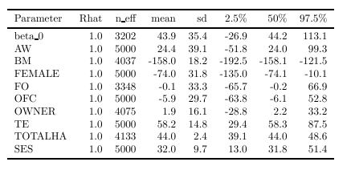

```{r echo=F, message=F, warning=F}
library(dplyr)
library(ggplot2)
library(rstan)
library(shinystan)

source("C:\\Users\\Emily Burchfield\\Box Sync\\WF\\Survey\\load_seads_data.R")
source("C:\\Users\\Emily Burchfield\\Box Sync\\WF\\Survey\\variable_creation.R")
lan <- tbl_df(read.csv("C:/Users/Emily Burchfield/Box Sync/WF//Survey/data/LAN.csv", stringsAsFactors = FALSE))
lan$SHENO <- lan$ï..SHENO  #sheno
land <- merge(lan, c1, by = "SHENO")

#major system farmers only
major <- c1[c1$irrigtype == 1,]
```

# Community Demographics

In most villages, more than 30 individuals responded to the survey.  Many of the analyses presented below are multi-level, with indvidiuals grouped in communities, which accounts for community-level effects not captured in the measured survey data.  

```{r echo=F, message=F, fig.width=5, fig.height=3}
sample_size <- major %>% group_by(HI4_NAME) %>% summarise(n = n()) %>% mutate(count = n)

ggplot(data = sample_size, aes(x=sample_size$HI4_NAME, y=count, fill=sample_size$HI4_NAME)) +
  geom_bar(stat = "identity") +
  theme(legend.position = "none", axis.text.x = element_text(angle=45, hjust=1)) +
  xlab("") + ylab("n") 

```

In each community, only individuals of the same ethnic group answered survey questions, reflecting the ethnic homogeneity of many communities in the dry zone.  There is variation in ethnicity, however, across communities.  The Mawilankerny community is a Tamil community and all other communities are Sinhalese.

```{r echo=F, message=F}
ethnicity <- major %>% 
  group_by(HI4_NAME, sinhalese) %>% 
  summarise(n = n()) %>% 
  mutate(freq = n/sum(n))
```

# Across Community Analyses

In the HPG and JG communities, the majority of farmers had not heard of bethma.  In the remaining four communities, the majority of farmers had practiced bethma at some point in the past.  Only in Mawilakerny and Unit 12 was bethma practiced by the majority of farmers during the Yala 2014 season.  Overall, water scarcity was the most frequently listed reason for practicing bethma during the Yala 2014 season.  There are interesting variations in the perceived effectiveness and riskiness of bethma across and within communities.  

## ADP1_A1: Have you heard of bethma?

In four communities, all farmers had heard of bethma.  In HPG, 91 percent of farmers had not heard of bethma.  In JG, 83 percent of farmers had not heard of bethma.  

```{r echo=F, message=F, , fig.width=5, fig.height=3, warning=F}
grp <- major %>% group_by(HI4_NAME, ADP1_A1) %>%   summarise(n = n()) %>% mutate(freq = n/sum(n))
yes <- grp[grp$ADP1_A1 == 1,]  #1 = YES; 2 = NO

ggplot(data = yes, aes(x=yes$HI4_NAME, y=yes$freq, fill=yes$HI4_NAME)) +
  geom_bar(stat = "identity") +
  theme(legend.position = "none", axis.text.x = element_text(angle=45, hjust=1)) +
  xlab("") + ylab("%") 
```

## ADP1_B1:  Have you ever practiced bethma?

In the two communities where few farmers had heard of bethma (HPG and JG), no farmers had ever practiced bethma.  In the remaining four communities, the percent of farmers who had practiced bethma within the community ranged from 54 percent (8 Yaya) to 92 percent (C Yaya). 

```{r echo=F, message=F, warning=F, fig.width=5, fig.height=3}

cnt <- major %>% group_by(ADP1_B1) %>% summarise(n=n()) 
grp <- major %>% group_by(HI4_NAME, ADP1_B1) %>%   summarise(n = n()) %>% mutate(freq = n/sum(n))
yes <- grp[grp$ADP1_B1 == 1,]  #1 = YES; 2 = NO

ggplot(data = yes, aes(x=yes$HI4_NAME, y=yes$freq, fill=yes$HI4_NAME)) +
  geom_bar(stat = "identity") +
  theme(legend.position = "none", axis.text.x = element_text(angle=45, hjust=1)) +
  xlab("") + ylab("%") 
```

```{r echo=F, message=F, warning=F, eval=F}

subset <- major[!is.na(major$ADP1_B1),]
y <- subset$ADP_B1  #Have you ever practiced bethma?
y <-ifelse(y==1, 1, 0)  #1 = YES, 0 = NO
n <- length(y)

gn.names <- as.vector(subset$HI4)
uq <- unique(gn.names)
ngn <- length(uq)
gn <- rep(NA, ngn)
for (i in 1:ngn){
  gn[gn.names == uq[i]] <- i
  sample.size <- as.vector(table(gn))
}

subset$gn <- gn


ADP_model <-  'data {
  int<lower=0> n;             //number of farmers
  int<lower=0> ngn;           //number of gns
  int k;                      //number of predictors

  int<lower=0, upper=1> y[n];  //outcome
  row_vector[k] x[n];         //predictors
  int gn[n];                  //mapping gn to group

}

parameters{
  real alpha;               //constant
  real a[ngn];              //group-specific random effects
  vector[k] beta;           //predictor coefficiencts
  real sigma;               //standard deviation of random effects
}

model {
  alpha ~ normal(0,100);
  a ~ normal(0, sigma);
  beta ~ normal(0, 100);
  for (i in 1:n) {
    y[i] ~ bernoulli(inv_logit(alpha + a[gn[i]] + x[i]*beta));
  }

}'

#replace NA in ofc dataset
ofc = subset$FAR1B_20
ofc <- ifelse(ofc == 1, 1, 0)

data <- list(ofc = ofc, female = subset$female, ha = subset$Total_HA,
             ses = subset$Standardized_SES, land_owner = subset$owner, te = subset$tail_end, fo = subset$fo, aw = subset$agrowell_user, aw_ofc = subset$agrowell_user*ofc)

bm_data <- as.data.frame(data)

model_data <-  list(n=n, ngn = ngn, k=9, y = y, x= bm_data[,], gn = gn)

lfit_B1 <- stan(model_code = ADP_model, model_name = "bm", data = model_data, iter = 2000, chains = 2)
my_sso <- launch_shinystan(lfit_B1)
```

We constructed a multi-level logistic regression to determine the factors that increase farmers' propensity to participate in bethma.  Results are presented below:


Results suggest that being female has a signficant negative effect on participation in bethma.  Higher total hectares held and a field position at the tail-end of the system slightly increase the likelihood that farmers participate in bethma.

## ADP1_C1:  Did you pratcice bethma last season?

Farmers were asked whether they practiced bethma during the Maha 2014/15 or Yala 2014 seasons.  These seasons were both abnormally dry and bethma was practiced in many communities in the dry zone. No farmers surveyed reported practicing bethma only during the Maha 2014/15 season.  In general, it is rare for farmers to practice bethma during the Maha season. Four farmers in 8 Yaya and two farmers in Unit 12 reported practicing bethma in \textit{both} Maha 2014/15 and Yala 2014. Since only six farmers reported practicing bethma during the Maha season, the rest of the analyses presented in this document will focus on bethma during the Yala season.    

```{r echo=F, message=F, warning=F, fig.width=5, fig.height=3}
#farmers who practiced bethma during both Maha 2014/15 and Yala 2014 or only Yala 2014
cnt <- major %>% group_by(ADP1_C1) %>% summarise(n=n())
grp <- major %>% group_by(HI4_NAME, ADP1_C1) %>%   summarise(n = n()) %>% mutate(freq = n/sum(n))
yes <- grp[grp$ADP1_C1 >= 2 & grp$ADP1_C1 <=3,]  #2 = Yala

ggplot(data = yes, aes(x=yes$HI4_NAME, y=yes$freq, fill=yes$HI4_NAME)) +
  geom_bar(stat = "identity") +
  theme(legend.position = "none", axis.text.x = element_text(angle=45, hjust=1)) +
  xlab("") + ylab("%") 
```

Less than ten percent of farmers reported practicing bethma during the Yala season (this includes farmers who responded Yala and Both) in 8 Yaya (7 farmers or 19 percent) and C Yaya (2 farmers, less than 1 percent).  In Mawilankerny, 71 percent of farmers practiced bethma during the Yala 2014 season.  In Unit 12, 20 farmers (50 percent) reportedly practiced bethma during the Yala 2014 season and 2 practiced in both the Yala 2014 and Maha 2014/15 seasons.  

```{r echo=F, message=F, warning=F, fig.width=5, fig.height=3}

cnt <- major %>% group_by(ADP1_B1) %>% summarise(n=n()) 
grp <- major %>% group_by(HI4_NAME, ADP1_B1) %>%   summarise(n = n()) %>% mutate(freq = n/sum(n))
yes <- grp[grp$ADP1_B1 == 1,]  #1 = YES; 2 = NO

ggplot(data = yes, aes(x=yes$HI4_NAME, y=yes$freq, fill=yes$HI4_NAME)) +
  geom_bar(stat = "identity") +
  theme(legend.position = "none", axis.text.x = element_text(angle=45, hjust=1)) +
  xlab("") + ylab("%") 
```

The results of the MLM regression are presented below:

```{r echo=F, message=F, warning=F, eval=F}
subset <- major[!is.na(major$ADP1_C1),]
y <- subset$ADP1_C1  #Did you practice bethma during the 2014 drought?
#1 = MAHA, 2 = YALA, 3 = BOTH, 4 = NEITHER
y <-ifelse(y > 3, 0, 1)  #no MAHA responses
n <- length(y)

gn.names <- as.vector(subset$HI4)
uq <- unique(gn.names)
ngn <- length(uq)
gn <- rep(NA, ngn)
for (i in 1:ngn){
  gn[gn.names == uq[i]] <- i
  sample.size <- as.vector(table(gn))
}

subset$gn <- gn


ADP_model <-  'data {
  int<lower=0> n;             //number of farmers
  int<lower=0> ngn;           //number of gns
  int k;                      //number of predictors

  int<lower=0, upper=1> y[n];  //outcome
  row_vector[k] x[n];         //predictors
  int gn[n];                  //mapping gn to group

}

parameters{
  real alpha;               //constant
  real a[ngn];              //group-specific random effects
  vector[k] beta;           //predictor coefficiencts
  real sigma;               //standard deviation of random effects
}

model {
  alpha ~ normal(0,100);
  a ~ normal(0, sigma);
  beta ~ normal(0, 100);
  for (i in 1:n) {
    y[i] ~ bernoulli(inv_logit(alpha + a[gn[i]] + x[i]*beta));
  }

}'

#replace NA in ofc dataset
ofc = subset$FAR1B_20
ofc <- ifelse(ofc == 1, 1, 0)

data <- list(aw = subset$agrowell_user, female = subset$female, fo = subset$fo, ofc = ofc, owner = subset$owner, te = subset$tail_end, ha = subset$Total_HA, ses = subset$Standardized_SES)
  
bm_data <- as.data.frame(data)

model_data <-  list(n=n, ngn = ngn, k=8, y = y, x= bm_data[,], gn = gn)

lfit_B1 <- stan(model_code = ADP_model, model_name = "bm", data = model_data, iter = 2000, chains = 2)
my_sso <- launch_shinystan(lfit_B1)
```


## ADP1_D1:  Why did you practice bethma last season?

Farmers were asked to give one of five reasons they practiced bethma in the Yala 2014 season.  In 8 Yaya, the small subset of farmers who practiced bethma did so to increase income (n=2) or due to water scarcity (n=5).  In C Yaya, the few farmers who practiced in bethma did so because of water scarcity (n=4).  These small numbers suggest that the bethma practiced in these communities was highly local, perhaps around a single field canal or distributary canal.

In Unit 12, where 50 percent of farmers participated in bethma, the main reason given was water scarcity (n=18) followed by a desire to increase income (n=4). Though individual farmers had the option of giving more than answer, only in Mawilankerny did farmers actually give more than one reason for practicing bethma. A total of 20 farmers listed water scarcity as a reason for practicing bethma.  Only 2 listed a desire to increase income, 6 because they were advised by an expert, 15 because the practice is common in the area, and 11 that the practice is a custom/tradition.

```{r echo=F, message=F, fig.width=5, fig.height=3}
cnt <- major %>% group_by(ADP1_D1_1) %>% summarise(n=n())
grp <- major %>% group_by(HI4_NAME, ADP1_D1_1) %>% summarise(n = n()) %>% mutate(freq = n/sum(n))
#ADP1_D1_2:  Mawilankerny only
  # Water scarcity (2): 2
  # Advised by expert (3): 3
  # Common in area (4): 9 
#ADP1_D1_3:  M. only
  # Advised by expert (3): 2
  # Common in area (4): 3
#ADP1_D1_4:  M. only
  # Common in area (4): 2
  # Custom/tradition (5): 3
#ADP1_D1_5: M. only
  # Custom/tradition (5): 5

yes <- grp[grp$ADP1_D1_1 == 3,]  #2 = Yala
```

## ADP1_E1:  Was bethma effective?

In C Yaya, the four farmers who practiced bethma during Yala 2014 found the practice "very effective."  In 8 Yaya, 4 farmers found hte practice "not at all effective", 1 "a little effective" and 2 "moderately effective."  In Mawilankerny, 51 percent of farmers found bethma "moderately effective" and an additional 3 percent found it very "effective."  14 percent found it "not at all effective" and 3 percent "a little effective."  In Unit 12, 27 percent of farmers found bethma "moderately effective" and 10 percent "very effective."  15 percent found bethma "a little effective" and one farmer found it "not at all effective."

\textbf{Interesting question}:  Why the variation in perceived effectiveness within this small subset of farmers?

```{r echo=F, message=F, fig.width=5, fig.height=3}
grp <- major %>% group_by(HI4_NAME, ADP1_E1) %>%   summarise(n = n()) %>% mutate(freq = n/sum(n))
```

We performed the multi-level logistic regression to determine the factors that describe farmers who found bethma very/moderately effective (1) or a little/not at all effective (0).  NOTE:  Very few farmers responded to this question, only 58 of the 285 farmers.  Results should be interpreted with caution.

```{r echo=F, message=F, warning=F, eval=F}

subset <- major[!is.na(major$ADP1_E1),]
y <- subset$ADP1_E1  #Was bethma effective?
y <-ifelse(y>2, 1, 0)  #1 = very/moderately, 0 = not at all, a little
n <- length(y)

gn.names <- as.vector(subset$HI4)
uq <- unique(gn.names)
ngn <- length(uq)
gn <- rep(NA, ngn)
for (i in 1:ngn){
  gn[gn.names == uq[i]] <- i
  sample.size <- as.vector(table(gn))
}

subset$gn <- gn


ADP_model <-  'data {
  int<lower=0> n;             //number of farmers
  int<lower=0> ngn;           //number of gns
  int k;                      //number of predictors

  int<lower=0, upper=1> y[n];  //outcome
  row_vector[k] x[n];         //predictors
  int gn[n];                  //mapping gn to group

}

parameters{
  real alpha;               //constant
  real a[ngn];              //group-specific random effects
  vector[k] beta;           //predictor coefficiencts
  real sigma;               //standard deviation of random effects
}

model {
  alpha ~ normal(0,100);
  a ~ normal(0, sigma);
  beta ~ normal(0, 100);
  for (i in 1:n) {
    y[i] ~ bernoulli(inv_logit(alpha + a[gn[i]] + x[i]*beta));
  }

}'

#replace NA in ofc dataset
ofc = subset$FAR1B_20
ofc <- ifelse(ofc == 1, 1, 0)

data <- list(ofc = ofc, female = subset$female, ha = subset$Total_HA,
             ses = subset$Standardized_SES, land_owner = subset$owner, te = subset$tail_end, fo = subset$fo, aw = subset$agrowell_user)

bm_data <- as.data.frame(data)

model_data <-  list(n=n, ngn = ngn, k=8, y = y, x= bm_data[,], gn = gn)

lfit_E1 <- stan(model_code = ADP_model, model_name = "bm", data = model_data, iter = 2000, chains = 2)
my_sso_E1 <- launch_shinystan(lfit_E1)
```


Results suggest that, as in the previous regression, being female decreases perceived effectiveness of bethma while hectares held and position at the tail-end of the system increase perceived effectiveness.   

## ADP1_F1:  Would you practice bethma in the future?

Farmers in all communities were asked whether they planned to practice bethma in the future.  In the two communities (HPG and JG) where few farmers had heard of or practiced bethma, few farmers responded positively.  In the two communities that recently practiced bethma, more than 75 percent of farmers agreed they would practice bethma in the future.

```{r echo=F, message=F, warning=F, fig.width=5, fig.height=3}
grp <- major %>% group_by(HI4_NAME, ADP1_F1) %>%   summarise(n = n()) %>% mutate(freq = n/sum(n))
yes <- grp[grp$ADP1_F1 == 1,]  #1 = YES; 2 = NO

ggplot(data = yes, aes(x=yes$HI4_NAME, y=yes$freq, fill=yes$HI4_NAME)) +
  geom_bar(stat = "identity") +
  theme(legend.position = "none", axis.text.x = element_text(angle=45, hjust=1)) +
  xlab("") + ylab("%") 
```

\textbf{Interesting question:}  Are the same farmers who responded that they would practice in the future those that recently practiced bethma?  Did they perceive it as effective?

To answer this question, we added to predictors to the regression, (1) whether farmers practiced bethma in the Yala 2014 season.  It woudl be cool to add (2) whether they found it very/moderately effective (1) or a little/not at all effective (0), but there are two few responses to include this variable.  

```{r echo=F, message=F, warning=F, eval=F}

subset <- major[!is.na(major$ADP1_F1),]
y <- subset$ADP1_F1  #Would you practice bethma in the future?
y <-ifelse(y==1, 1, 0)  #1 = YES, 0 = NO
n <- length(y)

gn.names <- as.vector(subset$HI4)
uq <- unique(gn.names)
ngn <- length(uq)
gn <- rep(NA, ngn)
for (i in 1:ngn){
  gn[gn.names == uq[i]] <- i
  sample.size <- as.vector(table(gn))
}

subset$gn <- gn


ADP_model <-  'data {
  int<lower=0> n;             //number of farmers
  int<lower=0> ngn;           //number of gns
  int k;                      //number of predictors

  int<lower=0, upper=1> y[n];  //outcome
  row_vector[k] x[n];         //predictors
  int gn[n];                  //mapping gn to group

}

parameters{
  real alpha;               //constant
  real a[ngn];              //group-specific random effects
  vector[k] beta;           //predictor coefficiencts
  real sigma;               //standard deviation of random effects
}

model {
  alpha ~ normal(0,100);
  a ~ normal(0, sigma);
  beta ~ normal(0, 100);
  for (i in 1:n) {
    y[i] ~ bernoulli(inv_logit(alpha + a[gn[i]] + x[i]*beta));
  }

}'

#replace NA in ofc dataset
ofc = subset$FAR1B_20
ofc <- ifelse(ofc == 1, 1, 0)

prac <- subset$ADP1_B1

data <- list(ofc = ofc, female = subset$female, ha = subset$Total_HA,
             ses = subset$Standardized_SES, land_owner = subset$owner, te = subset$tail_end, fo = subset$fo, aw = subset$agrowell_user, prac = prac)

bm_data <- as.data.frame(data)

model_data <-  list(n=n, ngn = ngn, k=9, y = y, x= bm_data[,], gn = gn)

lfit_F1 <- stan(model_code = ADP_model, model_name = "bm", data = model_data, iter = 2000, chains = 2)
my_sso <- launch_shinystan(lfit_F1)
```

Results suggest the same pattern.  The same farmers that find bethma effective and have participated in it in the past (i.e. males with land who are located at the tail-end of the system) are more liklely to practice bethma in the future.


## ADP1_G1:  Why haven't you practiced bethma?

For the subset of farmers who have never practiced bethma, they were asked why not.  Note that there are 233 NAs for this question.  Of the respondents, the most common response was that bethma was not effective (6 percent of total), followed by the response "no barriers" (4 percent).  Only one farmer felt that bethma takes too much time.  Five responded that bethma was too expensive.  2 felt that there was insufficient labor available to conduct bethma.  4 disliked the reduction in yield and 6 listed some other concern.

```{r echo=F, message=F, fig.width=5, fig.height=3}
grp <- major %>% group_by(ADP1_G1_1) %>%   summarise(n = n()) %>% mutate(freq = n/sum(n))
```

## ADP1_H1:  Is bethma risky?

In 8 Yaya, 50 percent of farmers found bethma moderately or very risky.  In C Yaya, this number dropped to 35 percent.  Response rates were very low in HPG and JG.  In Mawilankerny, 27 percent of farmers found bethma moderately or very risky, and 32 percent in Unit 12.  The remaining farmers found it a little risky or not at all risky.

```{r echo=F, message=F, , fig.width=5, fig.height=3}
grp <- major %>% group_by(HI4_NAME, ADP1_H1) %>%   summarise(n = n()) %>% mutate(freq = n/sum(n))
yes <- grp[grp$ADP1_H1 <=3,]  #Moderately or very risky
```


## Effects of bethma on yield

I frame these regressions two ways.  First I look at the effect of practicing bethma during the Yala 2014 season (ADP1C1) on Yala 2014 yields (FAR1D5), controlling for the same subset of demographic variables I've controlled for in all of the regressions.  For this regression, I coded farmers who practiced bethma during the 2014 drought with a 1 and all other farmers (NA and 0) as 0 for question ADP1C1.  NA responses to ADP1C1 indicate that farmers have not heard of bethma and did not answer the series of ADP1 questions related to bethma.  Since these farmers have not heard of bethma, it's safe to assume that their yields were unaffected by participation in bethma.  First we present the results from a regression with the variable rice-per-acre as the dependent variable:

```{r echo=F, message=F, warning=F, eval=F}
subset <- major[!is.na(major$FAR1C_5),]
adpc1 <- ifelse(subset$ADP1_C1 > 3, 0, 1) 
adpc1[is.na(adpc1)] <- 0
y <- subset$FAR1C_5
n <- length(y)
gn.names <- as.vector(subset$HI4)
uq <- unique(gn.names)
ngn <- length(uq)
gn <- rep(NA, ngn)
for (i in 1:ngn){
  gn[gn.names == uq[i]] <- i
  sample.size <- as.vector(table(gn))
}
subset$gn <- gn


mlm_model <-  'data {
  int<lower=0> n;             //number of farmers
  int<lower=0> ngn;           //number of gns
  int k;                      //number of predictors

  real<lower=0> y[n];          //outcome
  row_vector[k] x[n];         //predictors
  int gn[n];                  //mapping gn to group

}

parameters{
  real alpha;               //constant
  real a[ngn];              //group-specific random effects
  vector[k] beta;           //predictor coefficiencts
  real<lower=0, upper=100> sigma_a;             //standard deviation of group random effects
  real<lower=0, upper=100> sigma_y;             //standard deviation of overall random effects
}

transformed parameters{
  vector[n] y_hat;

  for (i in 1:n) { 
    y_hat[i] <- a[gn[i]] + x[i]*beta;
  }
}

model {
  alpha ~ normal(0,1);
  a ~ normal(alpha, sigma_a);
  beta ~ normal(0, 1);
  y~normal(y_hat, sigma_y);
}'

#replace NA in ofc dataset
ofc = subset$FAR1B_20
ofc <- ifelse(ofc == 1, 1, 0)

data <- list(aw = subset$agrowell_user, bm = adpc1, female = subset$female, fo = subset$fo, ofc = ofc, owner = subset$owner, te = subset$tail_end, ha = subset$Total_HA, ses = subset$Standardized_SES)
  
bm_data <- as.data.frame(data)

model_data <-  list(n=n, ngn = ngn, k=9, y = y, x= bm_data[,], gn = gn)

lfit_c1 <- stan(model_code = mlm_model, model_name = "bm_yields", data = model_data, iter = 5000, chains = 2)
my_sso <- launch_shinystan(lfit_c1)

pooled_model <-  'data {
  int<lower=0> n;             //number of farmers
  real<lower=0> y[n];          //outcome
  vector[n] aw;
  vector[n] bm;
  vector[n] female;
  vector[n] fo;
  vector[n] ofc;
  vector[n] owner;
  vector[n] te;
  vector[n] ha;
  vector[n] ses;
}

parameters{
  real beta_0;               //constant
  vector[9] beta;           //predictor coefficiencts
  real<lower=0, upper=100> sigma_y;             //standard deviation of overall random effects
}

model {
  y~normal(beta_0 + beta[1]*aw + beta[2]*bm + beta[3]*female + beta[4]*fo + beta[5]*ofc + beta[6]*owner +
beta[7]*te + beta[8]*ha + beta[9]*ses, sigma_y);
}'

data <- list(aw = subset$agrowell_user, bm = adpc1, female = subset$female, fo = subset$fo, ofc = ofc, owner = subset$owner, te = subset$tail_end, ha = subset$Total_HA, ses = subset$Standardized_SES, y=y, n=n)
  

#replace NA in ofc dataset
lfit_pool <- stan(model_code = pooled_model, model_name = "bm_yields_pooled", data = data, iter = 5000, chains = 2)
my_sso <- launch_shinystan(lfit_pool)

```

The results from the multi-level model were largley insignificant, but when estimating a pooled model, i.e. all farmers taken as a single sample, we see some interesting effects.  The effect of participating in bethma is negative, and strongly so.  The effects of being at the tail-end of a canal were positive; total hectares (unsurprisingly) had a positive effect, and socio-economic status had a positive effect.

First we present the non-significant results from the multi-level model:


Here are the more promising results from the pooled model (no multi-level grouping of farmers within communities):




